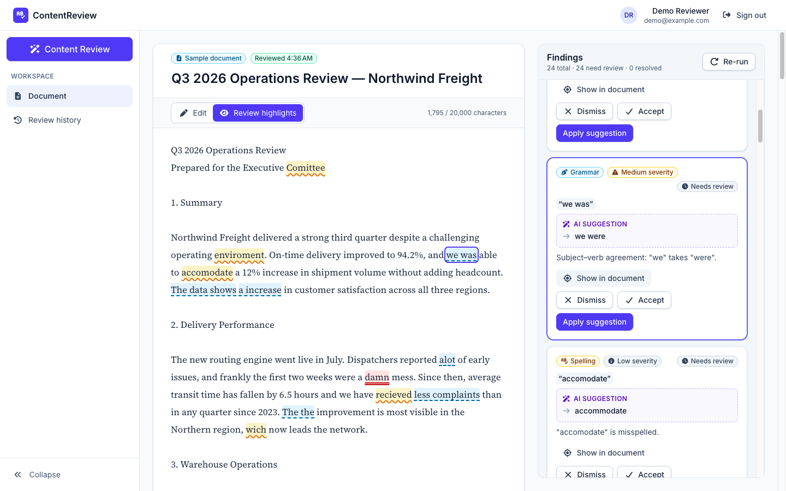
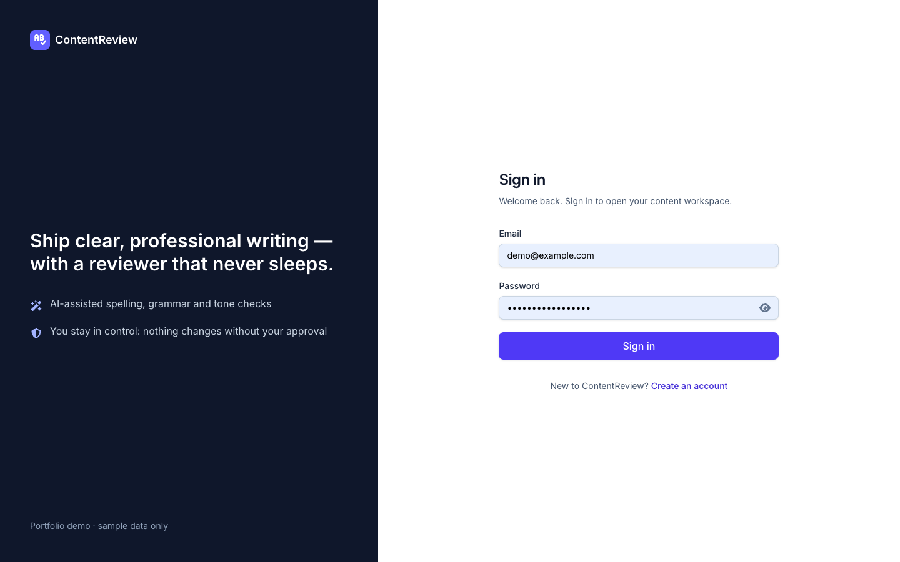
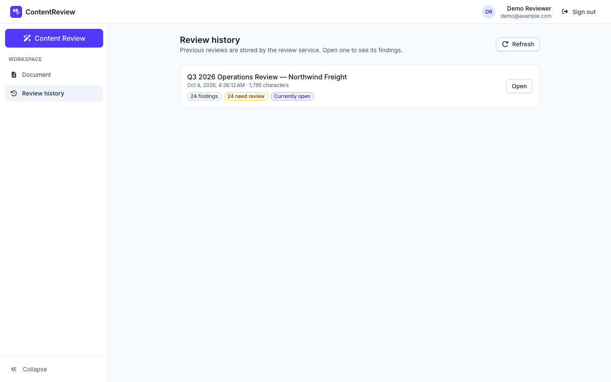
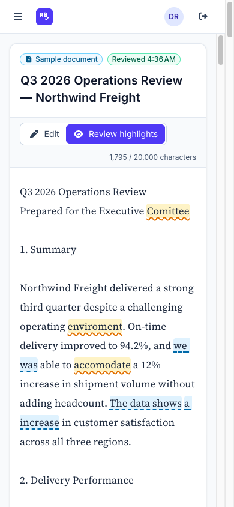

# ContentReview UI

An Angular 22 frontend for an AI-powered content review platform. Users sign in, edit a document, send it to the review service, and work through the findings for spelling, grammar and inappropriate language. Each finding can be inspected in context, and its AI suggestion accepted (applied to the text) or undone before the changes are saved.



| Sign in | Review history | Mobile |
| --- | --- | --- |
|  |  |  |

## Highlights

- **Angular 22, idiomatic:** standalone components, zoneless change detection, OnPush by default, signals for state, RxJS for HTTP, functional guards and interceptors, `@Service`, lazy-loaded routes, and typed Reactive Forms.
- **Real review workflow:** the review sends the text that is in the editor when you click. It handles loading, empty, validation, timeout and failure states, keeps the document intact on errors, and supports retry. Stale responses are cancelled.
- **Safe highlighting:** overlapping and nested finding ranges are split into non-overlapping segments, rendered with interpolation only (never `innerHTML`), and turned off automatically when the text no longer matches the review.
- **You stay in control:** AI suggestions are clearly labelled and are only applied after explicit confirmation. Later highlights are re-based after each edit.
- **Security-aware:** HttpOnly session cookie, double-submit CSRF, credentials sent only to the API, a central 401 handler, open-redirect protection, and no tokens or secrets in the browser.
- **Accessible:** labelled controls, linked error messages, focus management, a keyboard-operable drawer and dialogs, live regions, no colour-only meaning, and the Angular ESLint accessibility rules.
- **Tested:** 162 unit and component tests (Vitest) against a mocked backend, covering validation, guards, interceptors, the review store, highlighting edge cases and the interactive UI.

## Tech stack

| | |
| --- | --- |
| Framework | Angular 22 (standalone, zoneless), TypeScript 6 in strict mode with strict templates |
| Styling | Tailwind CSS 4 with design tokens in `src/styles.css` |
| Icons | Font Awesome (solid set, imported per icon so it tree-shakes) |
| Forms | Typed Reactive Forms |
| Testing | Vitest via `@angular/build:unit-test`, jsdom, `HttpTestingController` |
| Linting | ESLint 10 with `angular-eslint`, including template accessibility rules; Prettier |
| Dev backend | A small Express mock of the ContentReviewService (`mock-server/`) |

## Getting started

### Prerequisites

- Node.js **22.12+** (developed on Node 24)
- npm 10+

### Install and run

```bash
npm install
npm run dev
```

`npm run dev` starts:

- the **mock API** on http://localhost:3000/api/v1
- the **Angular dev server** on http://localhost:4200, which proxies `/api` to the mock, so cookies stay same-origin

Open http://localhost:4200 and sign in with the demo account:

| Email | Password | Role |
| --- | --- | --- |
| `demo@example.com` | `Demo!Passw0rd2026` | **Author**: edits the document, runs reviews, accepts and saves changes |
| `reader@example.com` | `Reader!Passw0rd2026` | **Read only**: sees the document text only |

You can also register a new account (new accounts are authors). The mock keeps data in memory, so a restart clears registered users, sessions and reviews.

### Scripts

| Command | Purpose |
| --- | --- |
| `npm run dev` | Mock API and Angular dev server together |
| `npm start` | Angular dev server only (expects an API on `localhost:3000`) |
| `npm run mock-api` | Mock API only |
| `npm run build` | Production build to `dist/content-review-ui` |
| `npm test` | Unit tests in watch mode |
| `npm run test:ci` | Unit tests, single run |
| `npm run lint` | ESLint (TypeScript and templates) |
| `npm run format` | Prettier |

## Configuration

The frontend has **no secrets**. Its public configuration lives in `src/environments/`:

```ts
// src/environments/environment.ts (production) — environment.development.ts is used by `ng serve`
export const environment: AppConfig = {
  production: true,
  apiBaseUrl: '/api/v1',     // keep same-site: required for SameSite cookies and Angular's XSRF support
  requestTimeoutMs: 15_000,
  reviewTimeoutMs: 60_000,   // reviews wait on the LLM pipeline
  review: { maxChars: 20_000 }, // must match the backend limit
};
```

To point the app at a real ContentReviewService, serve the SPA and the API from the same site, for example behind a reverse proxy that routes `/api` to the Node service. In development, change the `target` in `proxy.conf.json`.

The mock API reads an optional `.env` file. Copy `.env.example` to `.env` to change its settings:

| Variable | Default | Use |
| --- | --- | --- |
| `MOCK_REVIEW_FAILURE_RATE` | `0` | Set to `1` to demo the review error and retry UI |
| `MOCK_SESSION_TTL_MS` | 30 min | Shorten to demo session-expiry handling |
| `MOCK_LATENCY_MS` / `MOCK_REVIEW_LATENCY_MS` | `300` / `1200` | Simulated latency |

## Demo walkthrough

1. **Auth:** visit `/workspace` while signed out and you are redirected to `/login?returnUrl=…`. Try submitting an empty form, a malformed email, a wrong password, or registering with `demo@example.com` (duplicate email).
2. **Workspace:** the sample Q3 report is labelled **Sample document**. Editing it changes the label to **Edited draft · not saved**.
3. **Side panel:** collapse it to an icon rail with the control at the bottom; the setting is remembered. Below 1024 px it becomes a drawer, which opens from the ☰ button and closes with Escape or the backdrop.
4. **Review:** click **Content Review**. The findings appear as expanded cards showing the **Original** text, the **Improved** AI suggestion and an **Explanation**, and the document switches to **Review highlights**. Collapse cards individually from their header or with **Collapse all / Expand all**.
5. **Inspect:** click a card's body to scroll to and highlight just that issue, with its suggestion in green beside it. **Show all issues** highlights every issue at once. Filter findings by category or status.
6. **Act:** **Accept** applies the suggestion to the text immediately, without confirmation or an API call; **Undo** puts the original back. Accepted changes are kept locally for the session. **Save Changes** (enabled once something is accepted) asks for confirmation, then marks those findings resolved on the API; saved changes can't be undone.
7. **Stale protection:** edit the text after a review. Highlights turn off and the panel offers to re-run the review or restore the reviewed text.
8. **Failures:** run with `MOCK_REVIEW_FAILURE_RATE=1 npm run dev`. The review fails with a clear message, the document is unchanged, and **Retry review** is available.
9. **Roles:** sign in as `reader@example.com`. The header shows **Read only**, the document is plain read-only text, and the review action, findings and Review history are not available (visiting `/workspace/history` redirects back). The API also rejects review requests from this account with `403 FORBIDDEN`.
10. **Session expiry:** restart the mock API while signed in, then act on a finding. You are sent to sign in with a "session expired" notice and returned to where you were afterwards.
10. **History:** **Review history** lists previous reviews. Open one to load its findings.

## Architecture

```
src/app
├── core/          auth service, config token, guards, interceptors, error mapping, notifications
├── features/
│   ├── auth/            login, registration, validators
│   ├── workspace/       shell, header, side panel, document state, editor
│   └── content-review/  API client, ReviewStore, findings UI, highlighting, history
├── shared/        reusable UI (button, badge, form field, dialog, spinner, toasts, empty state)
└── testing/       test providers and fixtures
```

- **State:** signals in small services. `AuthService` is a root singleton. `DocumentService` and `ReviewStore` are provided by the workspace shell, so all document and review state is discarded on logout.
- **HTTP:** a typed API client per feature. `apiInterceptor` adds credentials and timeouts for API URLs only, and `authErrorInterceptor` handles 401s centrally. Errors are normalised into a typed `ApiError` and mapped to fixed user-facing copy.
- **Review flow:** each request goes through a `switchMap` stream, so the most recent request wins. The findings' baseline text is tracked to detect stale highlights, and ranges are re-based after suggestions are applied.

More detail is in [docs/architecture.md](docs/architecture.md), including the security model and accessibility notes. The backend contract is documented in [docs/api-contract.md](docs/api-contract.md).

## Security notes

- The session is a backend-managed **HttpOnly, Secure, SameSite=Strict** cookie. No token is ever readable by JavaScript or stored in localStorage.
- **CSRF** uses a double-submit `XSRF-TOKEN` cookie and the `X-XSRF-TOKEN` header, through Angular's built-in support.
- Route guards only improve the UX. **The backend authorizes every request**, and reviews are scoped to their owner.
- The Angular app never calls the Python LLM service. Only the Node service does.
- Document content is never rendered as HTML.

## Testing

```bash
npm run test:ci
```

The suite is 16 files and 138 tests, all running against `HttpTestingController` or pure functions. No live API or LLM is needed. It covers:

- Login and registration validation, loading, duplicate-submit prevention, and server error mapping
- `AuthService` state and roles, the auth/guest/author guards, `withCredentials` scoping, 401 handling and timeouts
- `ContentReviewApiService` requests and responses
- `ReviewStore`: current-content submission, validation, loading, error and retry, stale-response cancellation, accepting and undoing suggestions in any order, overlap blocking, and saving accepted changes
- `buildSegments`, `applyReplacements` and `mapRange` edge cases: overlap, nesting, duplicates, out-of-bounds input, surrogate pairs, empty documents and whitespace
- Components: rendered text matches the source exactly and HTML is never interpreted, the side panel collapses, the drawer handles Escape and returns focus, the finding card accordion and Accept/Undo, and the confirmation before saving changes

## Not in v1

- Document persistence. The API contract has no document endpoints, so edits stay as a local draft and each review stores a snapshot of what it reviewed.
- Streaming (SSE) results. These need an agreed streaming contract first; the UI does not fake streaming.
- End-to-end browser tests. The flows above were verified manually with Playwright, and a Playwright suite would be the next addition.
